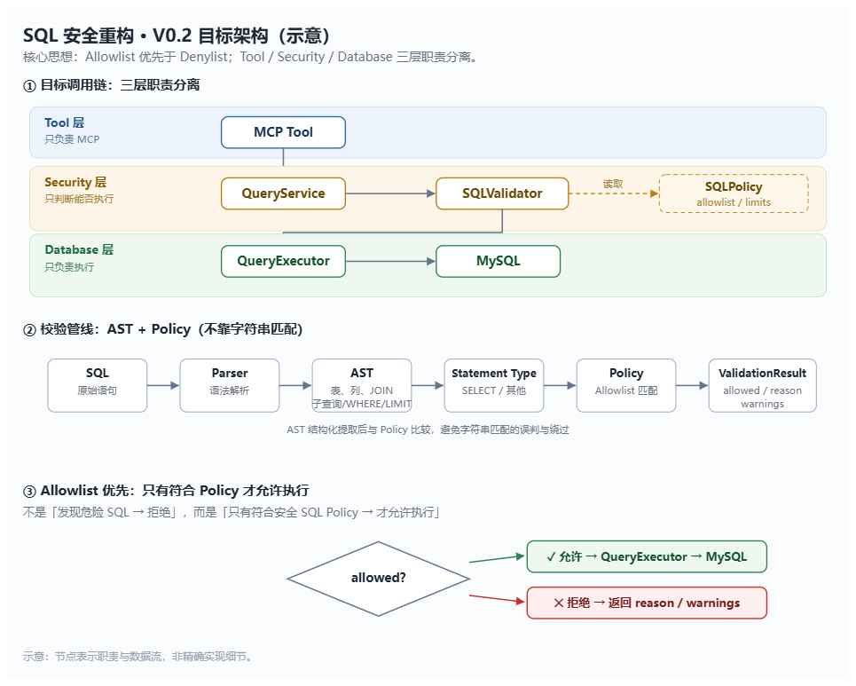

# SQL Agent + MySQL MCP Server


> **当前版本：v0.2.0**（SQL Security 重构：三层职责分离 + AST 校验 + Allowlist 优先）

一个通过 **MCP（Model Context Protocol）** 把数据库能力封装成工具、并用 **Agent** 自然语言查询 MySQL 的学习型项目。按「生产级 MCP」分层设计：数据访问是标准 MCP Server，安全防线独立成模块、策略外置为 YAML，Agent 动态发现工具、由大模型决定调用哪个工具解题。

## 它能做什么

输入一句自然语言，Agent 自动完成：发现工具 → 查表结构 → 生成只读 SQL → 执行 → 汇总答案。

- 简单查询、多表 JOIN、聚合统计、排序 + LIMIT
- SQL 错误自动修正
- 识别不存在的字段 / 表，不编造
- 拦截恶意 / 危险 SQL（基于 sqlglot AST 的校验管线：只读语句白名单 + 单语句 + 表/列 Allowlist + JOIN 上限 + 系统库封禁 + 行数/字节/长度/并发成本限制；关键字黑名单仅作辅助防线）

## 架构

```
┌──────────────────────────────┐
│  agent/                       │   自然语言问题
│   agent.py   ReAct 主循环     │─────────┐
│   client.py  MCP 会话 / 适配  │         │ ① 发现工具 (list_tools) + schema
│   config.py  LLM + 端点       │         │ ② 调用工具 (call_tool)
└──────────────┬───────────────┘         │
               │                          │
┌──────────────▼───────────────┐         │
│  mcp_server/                  │  python -m mcp_server.server
│   server.py    组装工具+资源   │   默认 Streamable HTTP（常驻服务）
│   tools/       schema / query │   可切 stdio（MCP_TRANSPORT=stdio）
│   security/    parser/policy/ │
│                validator/     │  ← 只读安全防线（策略见 configs/security.yaml）
│                models         │
│   database/    connection/    │
│                executor       │
│   config.py    DB + 传输参数   │
└──────────────┬───────────────┘
               │ ③ 连接
┌──────────────▼───────────────┐
│  MySQL sales_demo            │  独立业务库：company / sale_records
└──────────────────────────────┘
```

### SQL 安全架构（V0.2）



- **① 三层职责分离**：Tool 层只负责 MCP 协议；Security 层只回答「这条 SQL 能不能执行」；Database 层只负责执行。
- **② 校验管线基于 AST**：SQL → Parser → AST（表 / 列 / JOIN / 子查询 / LIMIT）→ Statement Type → Policy → ValidationResult，结构提取后再比对，避免字符串匹配的误判与绕过。
- **③ Allowlist 优先于 Denylist**：不是「发现危险才拒绝」，而是「符合安全 Policy 才允许执行」。

MCP 对外能力：

| 类型 | 名称 | 说明 |
| --- | --- | --- |
| Tool | `list_tables` | 列出业务库所有表 |
| Tool | `get_schema(table_name)` | 查看某张表的结构（列名/类型/可空/主键） |
| Tool | `run_query(sql)` | 执行只读 SQL（仅单条 SELECT），返回行数据 |
| Resource | `database://schema` | 全库所有表结构（应用预取，省钱省轮次） |
| Resource | `database://table/{table_name}` | 单表结构（URI 模板资源） |

## 快速开始

### 1. 环境准备

```bash
# Python 3.12+
python -m venv .venv
.venv\Scripts\activate        # Windows；macOS/Linux: source .venv/bin/activate
pip install -r requirements.txt
```

### 2. 配置连接

```bash
cp .env.example .env          # 然后编辑 .env 填入数据库密码 与 LLM API Key
```

### 3. 建库造数

```bash
python scripts/db_init.py --reset   # 创建 sales_demo 库、建表、随机造数
```

### 4. 启动 MCP Server（HTTP 常驻）

```bash
python -m mcp_server.server
# 监听 http://127.0.0.1:8000/mcp（可用 MCP_HOST / MCP_PORT / MCP_PATH 覆盖）
```

### 5. 跑 Agent

```bash
# 方式一：直接问答（另开一个终端）
python -m agent.agent "今年销售额最高的10家公司"

# 方式二：打印工具调用过程（看 Agent 一步步调了哪些工具、SQL、结果）
python -m agent.agent "各行业今年的销售总额排名" --trace
```

> 包内使用相对导入，请在**项目根目录**用 `python -m ...` 方式运行。

## 目录结构

```
agent/                  Agent 侧
  config.py             LLM 参数 + MCP 端点
  client.py             MCP 会话管理与 MCP→OpenAI 适配
  agent.py              SQLAgent（ReAct + function calling）主循环

mcp_server/             Server 侧
  server.py             入口：注册工具/资源、启动传输层
  config.py             数据库连接 + 传输参数
  tools/
    schema.py           list_tables / get_schema
    query.py            run_query（仅 MCP 协议转换，委托 QueryService）
  services/
    query_service.py    编排层：安全校验 → LIMIT 注入 → 执行 → 错误收敛
  security/             只读安全防线
    models.py           数据模型（策略/解析结果/校验结果/查询结果）
    parser.py           基于 sqlglot 的 AST 解析（表/列/函数/JOIN/子查询深度）
    policy.py           策略加载（YAML）与规则匹配
    validator.py        校验流水线 → ValidationResult（语句/表/列 ACL/JOIN 上限）
  database/
    connection.py       pymysql 连接与游标上下文
    executor.py         只读查询执行（超时 + 行数 + 字节上限），不含安全判定

configs/security.yaml   安全策略（只读白名单/系统库/表列 Allowlist/JOIN/成本限制）

tests/                  单元测试（pytest）
  test_sql_parser.py    解析：拆分、分类、抽表名、标识符
  test_sql_policy.py    策略：加载与关键字/正则/系统库匹配
  test_sql_validator.py 校验流水线：放行与各类拒绝
  test_query.py         run_query：校验拦截、LIMIT 补全、错误收敛

scripts/                辅助脚本
  db_init.py            建库、建表、造数
  batch_test.py         8 类问题批量回归 + 恶意 SQL 拦截测试

examples.md             已验证问题、SQL 与结果、8 类测试报告
.env.example            配置模板（键名 + 占位，无真实密钥）
```

## 测试

```bash
python -m pytest -q                      # 全部单元测试（不依赖数据库）
python -m pytest tests/test_sql_validator.py -q

# 可选：连真实数据库的集成用例（默认跳过）
$env:RUN_DB_TESTS=1; python -m pytest tests/test_query.py -q   # PowerShell
```

## 生产化要点

- **只读三层纵深**：Agent 约定只读 → MCP Server 基于 AST 的 Allowlist 校验（语句 / 表 / 列 ACL / JOIN 上限 / 系统库封禁 / 行数 + 字节 + 长度 + 并发）→ 数据库账号建议只授 SELECT 权限
- **策略外置**：安全规则集中在 `configs/security.yaml`，收紧/放宽无需改代码；`mcp_server/security/` 负责解析与判定
- **校验先于连库**：`run_query` 先校验再建连，恶意 SQL 在无数据库时也会被直接拒绝
- **凭证隔离**：连接串、Key 全部走 `.env`，代码零硬编码；`.env` 已被 `.gitignore` 拦截
- **版本注意**：本项目用 mcp **2.x** 的 `MCPServer`（v1 的 `FastMCP` 已改名，勿用旧教程 API）

## 已知边界

- 关键字黑名单是**粗粒度**防线，只应对常规风险；生产环境仍应以数据库最小权限（只读账号、禁止 UDF/`LOAD_FILE` 等）为根本
- 解析基于 `sqlglot` 的 AST，表/列/函数/JOIN 取自真实语法结构而非字符串匹配；`@@version` 这类符号 token AST 不可见，故保留 `forbidden_patterns` 作辅助防线兜底
- 列级 ACL 依赖 AST 中的显式列引用：`SELECT *` 不产生列引用，无法被列 Allowlist 覆盖；需严格列管控时应禁用 `*`（如改写为显式列清单）

## License

示例代码，MIT。
